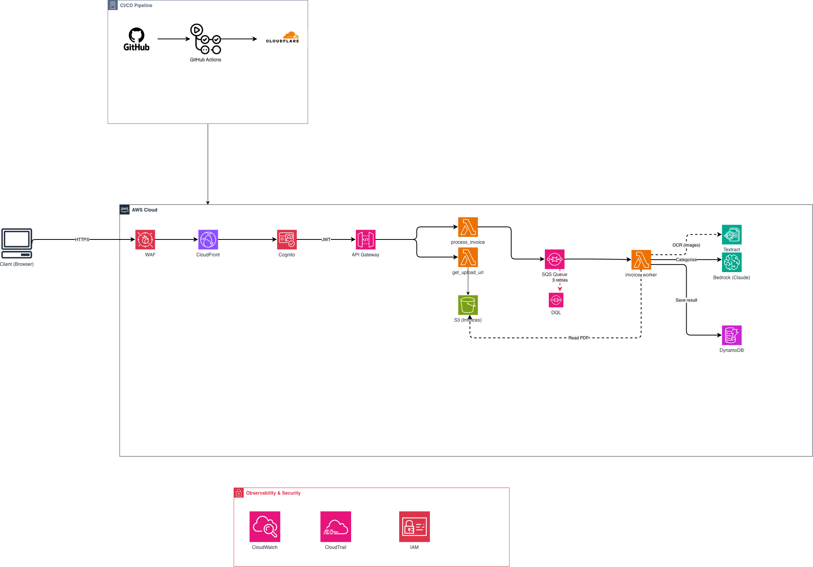

# Cadê Meu Salário

> Personal Finance App — Gestão de carteira de investimentos + análise inteligente de faturas com IA.

**[Live Demo](https://kdmeusalario.pages.dev)** — Explore com dados fictícios, sem criar conta.

---

## Sobre o Projeto

MicroSaaS de finanças pessoais que combina gestão de carteira de investimentos (ações + renda fixa) com análise automatizada de faturas de cartão de crédito usando OCR e IA generativa.

### Funcionalidades

- **Carteira de Investimentos** — Acompanhamento de ações (cotações em tempo real via Brapi), renda fixa, gráficos de evolução e distribuição
- **Análise de Faturas** — Upload de PDF/imagem → OCR → categorização automática via LLM
- **Dashboard** — Resumo visual de patrimônio, gastos por categoria, tendências mensais
- **Exportação** — Relatórios em Excel (carteira e faturas)
- **Modo Demo** — Visualização completa com dados mockados para visitantes

---

## Arquitetura



> [Abrir diagrama interativo (draw.io)](docs/architecture.drawio) — baixe e abra em [app.diagrams.net](https://app.diagrams.net)

### Fluxo de Processamento de Faturas

```
Upload PDF → S3 → API Gateway → Lambda (validate + rate limit)
                                        │
                                        ▼
                                   SQS Queue
                                        │
                                        ▼
                              Lambda Worker (async)
                                   │         │
                          Textract OCR    pypdf text
                                   │         │
                                   ▼         ▼
                            Amazon Bedrock (Claude)
                            Categorização de gastos
                                        │
                                        ▼
                                   DynamoDB
                                  (resultado)
                                        │
                                        ▼
                              Frontend (polling)
```

---

## Tech Stack

### Frontend
| Tecnologia | Uso |
|-----------|-----|
| React 18 + TypeScript | UI reativa com tipagem forte |
| Vite | Build e dev server ultrarrápido |
| Tailwind CSS | Estilização utility-first |
| Zustand | Estado global leve com persistência |
| Recharts | Gráficos interativos |
| Lucide React | Ícones |

### Backend (Serverless)
| Serviço | Uso |
|---------|-----|
| AWS Lambda (Python 3.13) | Processamento serverless |
| Amazon API Gateway (HTTP API) | REST endpoint com auth |
| Amazon Cognito | Autenticação (JWT) |
| Amazon S3 | Storage de uploads (TTL 30d) |
| Amazon SQS + DLQ | Fila assíncrona com retry |
| Amazon DynamoDB | Dados de usuário e cache |
| Amazon Textract | OCR de documentos |
| Amazon Bedrock (Claude Sonnet 4.5) | Categorização por IA |

### Infra e CI/CD
| Ferramenta | Uso |
|-----------|-----|
| AWS SAM | IaC (Infrastructure as Code) |
| GitHub Actions | CI/CD pipeline |
| Cloudflare Pages | Hosting frontend (CDN global) |

---

## Rate Limiting

| Plano | Faturas/mês |
|-------|-------------|
| Free | 3 |
| Premium | 10 |
| Admin | Ilimitado |

Limite verificado em dois pontos (defense in depth): na geração da URL de upload e no início do processamento.

---

## Estrutura do Projeto

```
├── .github/workflows/     # CI/CD (GitHub Actions → Cloudflare Pages)
├── infra/
│   ├── template.yaml      # AWS SAM template (toda infra como código)
│   └── lambda/            # Funções Lambda (Python)
│       ├── process_invoice.py   # Valida e enfileira
│       ├── invoice_worker.py    # Worker SQS (Textract + Bedrock)
│       ├── check_status.py      # Polling de resultado
│       ├── get_upload_url.py    # Presigned URL + rate limit
│       ├── bedrock_helper.py    # Prompts de categorização
│       ├── rate_limit.py        # Rate limiting por plano
│       └── user_data.py         # CRUD genérico DynamoDB
├── src/
│   ├── components/        # Componentes React reutilizáveis
│   ├── pages/             # Páginas da aplicação
│   ├── services/          # Integrações (API, auth, quotes)
│   ├── store/             # Zustand stores (estado persistido)
│   ├── hooks/             # Custom hooks
│   ├── data/              # Dados mockados (modo demo)
│   └── types/             # TypeScript interfaces
├── public/                # Assets estáticos
├── wrangler.toml          # Config Cloudflare Pages
└── package.json
```

---

## Rodando Localmente

```bash
# Instalar dependências
npm install

# Criar .env a partir do exemplo
cp .env.example .env
# Preencher VITE_API_URL, VITE_COGNITO_USER_POOL_ID, VITE_COGNITO_CLIENT_ID

# Dev server
npm run dev

# Build produção
npm run build
```

### Deploy Backend (AWS)

```bash
sam build --template-file infra/template.yaml --build-dir infra/.aws-sam/build
sam deploy --template-file infra/.aws-sam/build/template.yaml \
  --stack-name kdmeusalario \
  --capabilities CAPABILITY_IAM \
  --resolve-s3 \
  --region us-east-1
```

---

## Decisões Técnicas

- **SQS + DLQ** em vez de processamento síncrono — resiliência contra burst de uploads e timeout do Bedrock
- **pypdf + fallback Textract** — extração de texto grátis para PDFs textuais, Textract apenas para escaneados (reduz custo em ~80%)
- **Hash SHA-256 de deduplicação** — evita reprocessamento de faturas idênticas, economizando Textract + Bedrock
- **Cloudflare Pages** em vez de S3+CloudFront — deploy mais rápido, CDN global, zero config de invalidação
- **Zustand** em vez de Redux — simplicidade para app single-user, persist middleware nativo
- **Cognito custom:role + custom:plan** — controle de acesso e billing sem banco relacional
- **DynamoDB single-table** — schema flexível com `userId#dataType` para todos os dados

---

## Autor

**Caio Marini** — Cloud Architect & Data Engineer (AWS)

- [LinkedIn](https://www.linkedin.com/in/caio-marini/)
- [GitHub](https://github.com/caiomarini98)
